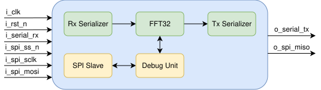

# 32-Point Complex FFT SoC with SPI Debug Interface

## Project Overview

This project implements a highly optimized **32-point Complex Fast Fourier Transform (FFT)** hardware accelerator designed for ASIC implementation. The system operates on **8-bit signed fixed-point data** (Real and Imaginary components) and features a fully serialized data path to minimize pin count, adhering to an 8-pin constraint.

A key feature of this design is its integrated **Debug & Observability System**. A dedicated SPI Slave interface runs in parallel with the main processing core, allowing for run-time configuration (Soft Reset, Enable, Inverse Mode) and real-time monitoring of internal status signals, saturation flags, and performance counters without disrupting the data flow.

## Top-Level Architecture

The design is hierarchical and composed of three main domains: the **Input/Output Serialization**, the **FFT Computational Core**, and the **Debug/Control Plane**.

### 1. Data Path Modules

* **`rx_serializer`**:
    * **Function:** Handles the ingestion of serial data streams. It implements a robust start-bit detector (edge-triggered) to synchronize incoming frames.
    * **Operation:** Converts the incoming serial line into parallel 8-bit signed IQ pairs. Generates the `rx_valid` signal to wake up the FFT core.
* **`tx_serializer`**:
    * **Function:** Serializes the processed parallel data back onto a single output pin.
    * **Operation:** Accepts valid results from the FFT core, buffers them, and transmits them bit-by-bit. It provides a `tx_ready` handshake signal to apply backpressure to the core if necessary.
* **`fft32` (The Core)**:
    * The central processing unit, decomposing the 32-point FFT into a mixed-radix architecture (Radix-4 followed by Radix-8 stages).
    * **`shift_r4`**: Input reordering buffer to align data for the initial Radix-4 stage.
    * **`fft4`**: Performs the first stage of butterflies (4-point DFT).
    * **`twiddle_interface`**: Applies complex multiplication factors (Twiddle Factors) stored in optimized lookup tables (implemented via combinatorial MUX logic for synthesis efficiency). Handles both Forward and Inverse coefficients.
    * **`shift_r2`**: Intermediate data reordering / commutator.
    * **`fft8`**: The backend processing engine using a pipelined **MDC (Multipath Delay Commutator)** architecture.
        * **`mdc8p_stage1`, `stage2`, `stage3`**: Sequential pipeline stages that perform Butterfly operations.
        * **`btfly_2`**: The fundamental computation unit (Add/Sub) instantiated within the stages.
    * **`buffer_parallel2serial`**: Captures the parallel output from the pipeline and serializes it internally for the final output stage.

### 2. Debug & Control Modules

* **`debug_system`**:
    * A wrapper module that encapsulates the SPI protocol logic and the register map.
* **`spi_slave_mode0`**:
    * Implements a standard 4-wire SPI protocol (CPOL=0, CPHA=0). Handles bit-level shifting and frame synchronization.
* **`debug_unit`**:
    * **Function:** Bridges the external SPI commands with the internal chip logic.
    * **Features:** Includes **CDC (Clock Domain Crossing)** logic to safely transfer signals between the asynchronous SPI domain and the fast system clock domain. It manages Control Registers (Outputs) and Probe Registers (Inputs).

## System Operation

1.  **Initialization:** Upon power-up, the system enters a safe state. The user can utilize the SPI interface to assert/deassert a **Soft Reset** or toggle the **System Enable** bit via the `sys_config` register.
2.  **Processing:**
    * Serial data is received on `i_serial_rx`.
    * The `rx_serializer` frames the data and passes 8-bit complex words to the `fft32`.
    * Data flows through the pipeline (`fft4` -> `twiddle` -> `fft8`).
    * The result is serialized and transmitted on `o_serial_tx`.
3.  **Observability (Glue Logic):**
    * **Counters:** The top level counts valid inputs (`cnt_inputs`) and valid outputs (`cnt_outputs`) to detect packet loss.
    * **Saturation Detection:** A "Sticky Bit" in the `error_flags` register latches high if any output value hits the maximum positive or negative rail (+127/-128), indicating clipping.
    * **Sniffers:** The debug unit captures the last valid output sample and intermediate signals (from the Twiddle stage) for mathematical verification.

## Interface Specifications (Pinout)

The design is optimized for a minimal footprint, utilizing exactly **8 Digital IO Pins**.

| Pin Name | Direction | Description |
| :--- | :---: | :--- |
| **System Signals** | | |
| `i_clk` | Input | Main System Clock. |
| `i_rst_n` | Input | Asynchronous Hardware Reset (Active Low). |
| **Data Interface** | | |
| `i_serial_rx` | Input | Serial Data Input (FFT samples). |
| `o_serial_tx` | Output | Serial Data Output (FFT results). |
| **Debug Interface (SPI)** | | |
| `i_spi_ss_n` | Input | SPI Slave Select (Active Low). Acts as CDC trigger. |
| `i_spi_sclk` | Input | SPI Serial Clock. |
| `i_spi_mosi` | Input | Master Out Slave In (Configuration Data). |
| `o_spi_miso` | Output | Master In Slave Out (Status Readback). |

---

## Register Map (Debug Unit)

### Control Registers (Write/Read)
* **0x10 - `sys_config`**:
    * `[0]`: **FFT Enable** (1 = Run, 0 = Pause).
    * `[1]`: **Inverse Mode** (1 = IFFT, 0 = FFT).
    * `[2]`: **Soft Reset** (1 = Reset Internal Logic).

### Status Registers (Read Only)
* **0x00 - `status_flags`**: Real-time status of Valid/Ready signals.
* **0x01 - `error_flags`**: Clipping detection (Sticky bit).
* **0x02 - `cnt_inputs`**: Counter of received words.
* **0x03 - `cnt_outputs`**: Counter of calculated FFTs.
* **0x04 - `last_out_re`**: Last valid Real output value.
* **0x05 - `last_out_im`**: Last valid Imaginary output value.
* **0x06 - `mid_data_re`**: Intermediate debug probe (Twiddle output).

## Block Diagrams

### FFT32 Datapath

### Top Level Block Diagram

