# Final Physical Design Report (PD) — `top_chip`

Previous analyses and the associated error fixes are documented in `pd_log.md`.

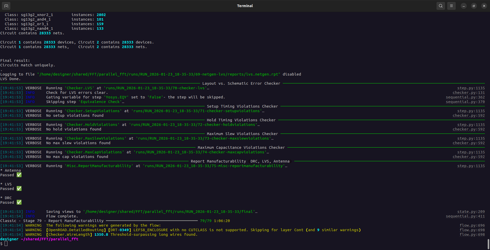

## Summary

This document summarizes the **final signoff results** of the physical design (PD) run for `top_chip` using **LibreLane**.  
All signoff checks passed (**DRC / LVS / Antenna**) and timing closed with **zero violations**.

---

## Table of Contents

1. [Post-Route Utilization](#1-post-route-utilization)
2. [Die & Core Area](#2-die--core-area)
3. [Cell Count & Chip Finishing](#3-cell-count--chip-finishing)
4. [Timing Closure](#4-timing-closure)
5. [Clock Tree Summary](#5-clock-tree-summary)
6. [Routing & DRC](#6-routing--drc)
7. [Signoff Checks](#7-signoff-checks)
8. [Power & IR-Drop](#8-power--ir-drop)
9. [Executive Conclusion](#9-executive-conclusion)
10. [Routing Warning: DRT-0349 (LEF58_ENCLOSURE)](#10-routing-warning-drt-0349-lef58_enclosure)
11. [Chip Finishing](#11-chip-finishing)
12. [Clock (CTS Visualization)](#12-clock-cts-visualization)
13. [IO and Power/Ground](#13-io-and-powerground)


---

## Reference

All numerical results below are taken from:

👉 **Download:**  
🔗 **https://drive.google.com/file/d/1n3HdCXurSAwhTBV4xbTFWmmR2EoYGsu7/view?usp=sharing**

_Path:_ `runs/RUN_2026-01-23_18-35-33/` 
---


## Area Sweep Summary and Final Selection

Multiple physical design runs performed with different **die/core area configurations** and **effective utilization levels** using the LibreLane flow.  
All configurations listed below were evaluated up to signoff (DRC/LVS/Antenna), unless otherwise noted.

The objective of this sweep was to identify the **minimum viable area** while maintaining robustness and to justify the final selected configuration with sufficient margin for future RTL modifications.

---

## Summary Table — Area vs. Flow Closure

| Case | DIE_AREA [µm] | CORE_AREA [µm] | Die Area [mm²] | Core Area [mm²] | Utilization | CTS / Placement | DRC / LVS / Antenna | Notes |
|-----:|---------------|----------------|---------------:|----------------:|------------:|------------------|---------------------|-------|
| **A (Final – Selected)** | `[0, 0, 880, 880]` | `[20.16, 22.68, 859.84, 857.32]` | **0.7744** | **0.6981** | **65.94% (measured)** | ✅ Pass | ✅ Pass | Selected for final delivery to preserve margin for future RTL changes and reduce congestion risk. |
| **B (Smaller – Working, 85%)** | `[0, 0, 774.25, 771.87]` | `[20.16, 22.68, 754.08, 748.44]` | **0.5976** | **0.5327** | **86.05% (measured)** | ✅ Pass | ✅ Pass | Fully signoff-clean at high utilization; tighter routing/CTS margin for future iterations. |
| **C (Intermediate – Working)** | `[0, 0, 827, 827]` | `[20.16, 22.68, 806.84, 804.32]` | **0.6839** | — | **≈75% (estimated)** | ✅ Pass | ✅ Pass | Balanced compromise between area reduction and physical margin. |
| **D (Aggressive – Failing)** | `[0, 0, 757.04, 755.19]` | `[20.16, 22.68, 736.88, 732.51]` | **0.5717** | — | **≈90% (target)** | ❌ Fail (CTS) | — | Flow fails during detailed placement / CTS (`DPL-0036`). Density too aggressive. |

**Notes**
- Areas in mm² are computed from `metrics.json` fields reported in µm² (1 mm² = 1,000,000 µm²).
- Core area values are included when available from the corresponding run’s `metrics.json`.

---

## Detailed Notes for Case B (≈85% Utilization)

For the configuration with:

```yaml
DIE_AREA:  [0, 0, 774.25, 771.87]
CORE_AREA: [20.16, 22.68, 754.08, 748.44]
```

Key measured metrics from `metrics.json`:

- **Die area:** 597,620 µm² → **0.5976 mm²**  
- **Core area:** 532,650 µm² → **0.5327 mm²**  
- **Post-route utilization:** **0.8605 (86.05%)**  
- **Timing:** Zero setup/hold violations across all corners  
- **Routing:** Zero DRC violations  
- **Signoff:** DRC / LVS / Antenna all passed  

This confirms that the design is physically implementable at high utilization levels, albeit with reduced headroom.

---

## Observations

- Reduced-area configurations down to **~0.60 mm²** successfully complete the full physical design flow and pass all signoff checks.
- As utilization approaches **~90%**, the flow becomes unstable and fails during **placement / CTS**, indicating insufficient whitespace for clock and routing resources.
- Configurations around **75–85% utilization** are viable but provide limited flexibility for future RTL growth.

---

## Final Decision Rationale

Despite smaller configurations being technically viable, the following configuration was selected for final submission:

```yaml
DIE_AREA:  [0, 0, 880, 880]
CORE_AREA: [20.16, 22.68, 859.84, 857.32]
```

This choice provides:

- A measured post-route utilization of **~65%**
- Comfortable routing and CTS margin
- Reduced sensitivity to design changes
- Higher robustness and repeatability of the physical design flow

---


## 1) Post-Route Utilization

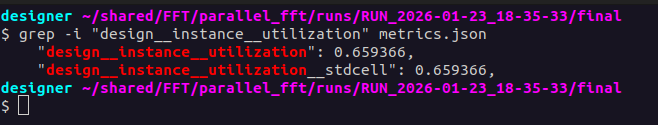

**Final post-route utilization:** **65.94%**  
(from `design__instance__utilization = 0.659366`)

This utilization is reported **after**:
- placement  
- CTS (clock tree synthesis)  
- detailed routing  
- filler insertion (chip finishing)

> **Note:** Utilization is reported after detailed routing and filler cell insertion.

---

## 2) Die & Core Area

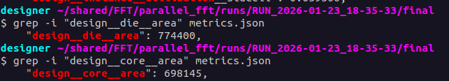

**Units in `metrics.json`:** µm²

| Metric | Value (µm²) | Value (mm²) |
|---|---:|---:|
| Die area | 774,400 | **0.7744** |
| Core area | 698,145 | **0.6981** |

---

## 3) Cell Count & Chip Finishing

### Instance breakdown

```json
"design__instance__count": 58867
"design__instance__count__stdcell": 28329
"design__instance__count__class:fill_cell": 30538
```

### Interpretation

- ~30k filler cells → **chip finishing is active and effective**
- No macros (standard-cell-only implementation)
- Fillers ensure continuous rows / substrate coverage and help meet well/tap requirements

**Report-ready sentence:**

> The design contains **28,329 standard cells**, with filler cells automatically inserted during chip finishing to ensure full substrate coverage.

---

## 4) Timing Closure

### Setup / Hold signoff (worst case)

```json
"timing__setup__wns": 0
"timing__hold__wns": 0
"timing__setup__tns": 0
"timing__hold__tns": 0
```

Additional context:
- Setup worst negative slack (WNS) ≈ **+42 ns**
- Hold worst negative slack (WNS) ≈ **+0.11 ns**
- Target clock period: **50 ns**

**Report-ready sentence:**

> Timing closure was achieved across all analyzed PVT corners, with zero setup and hold violations.


> Worst-case setup slack exceeds 40 ns, indicating a relaxed timing margin for the selected clock period.

---

## 5) Clock Tree Summary

### Clock buffering

```json
"design__instance__count__class:clock_buffer": 740
"design__instance__count__class:clock_inverter": 183
```

### Clock skew

```json
"clock__skew__worst_setup": -0.166 ns
```

**Report-ready sentence:**

> The clock distribution network was implemented using buffered clock trees, achieving a worst-case skew below **0.2 ns**.

---

## 6) Routing & DRC

### Routing results

```json
"route__drc_errors": 0
"route__wirelength": 663713
"route__wirelength__max": 1350.8
```

### Long-wire warning context

- The maximum routed net length is **1350.8**, slightly above the configured threshold (**1300**)  
- This does **not** impact timing closure and is explicitly allowed by configuration

**Report-ready sentence:**

> Detailed routing completed with zero DRC violations. One net slightly exceeded the configured long-wire threshold, without impact on timing or signal integrity.

---

## 7) Signoff Checks

All final signoff checks passed:

```json
"magic__drc_error__count": 0
"klayout__drc_error__count": 0
"design__lvs_error__count": 0
"antenna__violating__nets": 0
```

**Report-ready sentence:**

> The design successfully passed all signoff checks, including DRC, LVS, and antenna rules.

---

## 8) Power & IR-Drop

### Total power

```json
"power__total": 0.00726
```

### Worst IR drop

```json
"ir__drop__worst": 0.00249
```

Units:

Total power is reported in Watts (W).

IR-drop values are reported in Volts (V).


Interpretation:
- Worst IR drop < **0.25%** of nominal supply → **excellent power grid integrity**

**Report-ready sentence:**

> IR-drop analysis shows a worst-case voltage drop below **0.25%**, confirming adequate power grid integrity.

---

## 9) Executive Conclusion

**Final status:** ✅ **Signoff clean** (DRC/LVS/Antenna) + ✅ **Timing closed**

> The final physical design implementation achieved full timing closure, zero DRC/LVS violations, and successful chip finishing. The design occupies **0.774 mm²** with a post-routing utilization of **65.9%**, providing sufficient routing margin and robust manufacturability.


## 10) Routing Warning: DRT-0349 (LEF58_ENCLOSURE)

During the detailed routing stage, the following warnings were reported in `warning.log`:

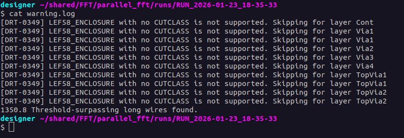

### Explanation

These warnings originate from **OpenROAD detailed routing (DRT)** when parsing **LEF58 enclosure rules** that do not explicitly define a `CUTCLASS`.  
This is a **known and expected limitation** for this PDK/LEF combination.


> The `DRT-0349` warnings related to `LEF58_ENCLOSURE with no CUTCLASS` are expected for this PDK and do not impact routing correctness or signoff quality. Since the design passes all post-route DRC, LVS, antenna, and timing checks, these warnings are considered non-blocking and safely ignored.


## 11) Chip Finishing

LibreLane automatically performs **chip finishing** during the final stages of the flow, including the insertion of **filler cells**, **tap cells**, and **well ties**.

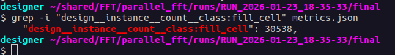

The presence of **30,538 filler cells** confirms that empty standard-cell rows were properly filled, ensuring continuous substrate coverage and a **DRC-clean** layout.

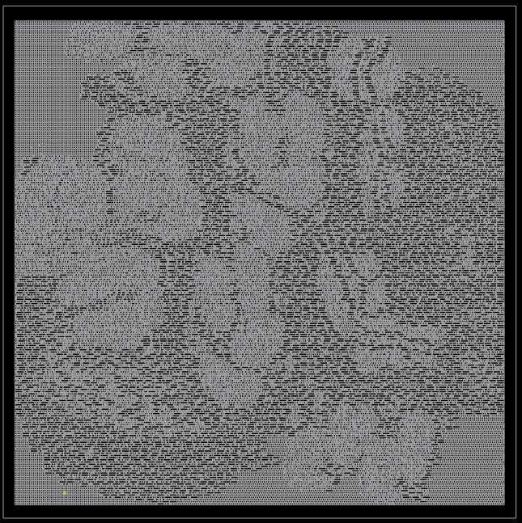

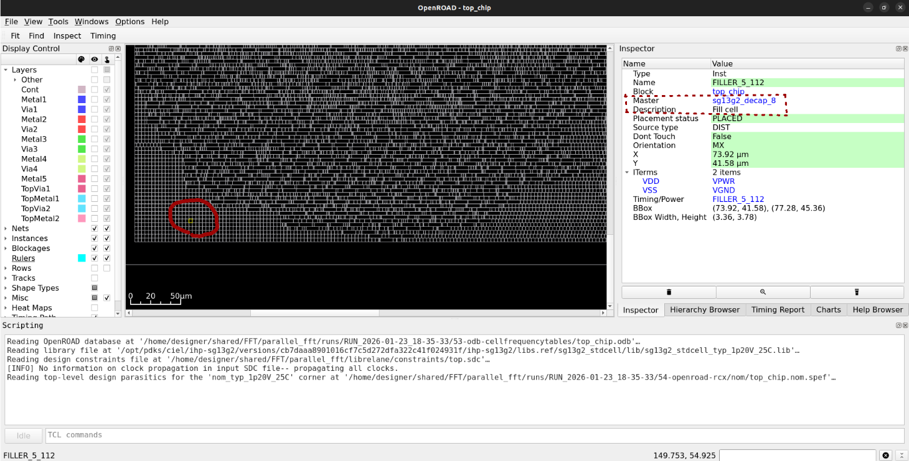

### Highlighting decap instances in the GUI (Tcl)

The following Tcl snippet selects instances whose **master/reference name** contains `decap` and highlights them in the OpenROAD GUI:

```tcl
::gui::clear_highlights

# Collect decap instance objects
set decap_objs {}
foreach c [get_cells -hier *] {
  set master [get_property $c ref_name]
  if {[string match "*decap*" $master]} {
    lappend decap_objs $c
  }
}
puts "Found [llength $decap_objs] decap instances"

# Highlight by NAME (not by handle)
set chunk 200
set n [llength $decap_objs]
for {set i 0} {$i < $n} {incr i $chunk} {
  set sub [lrange $decap_objs $i [expr {$i+$chunk-1}]]
  foreach obj $sub {
    # Try full_name first (more robust with hierarchy)
    set inst_name [get_property $obj full_name]
    if {$inst_name eq ""} {
      set inst_name [get_property $obj name]
    }
    ::gui::highlight_inst $inst_name
  }
  update
}
```

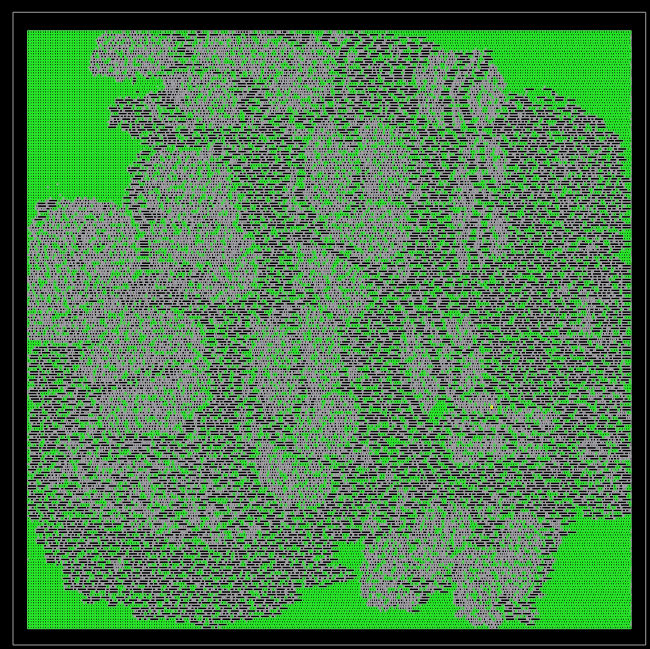

### Counting chip-finishing instances (Tcl)

To count “chip finishing” instances (decap/fill/tap/endcap) by `ref_name`, print a sorted breakdown, and report the grand total:

```tcl
# Count "chip finishing" instances: decap/fill/tap/endcap (by ref_name)
# Also prints a sorted breakdown and the grand total.

set counts [dict create]
set total 0

foreach c [get_cells -hier *] {
  set ref [get_property $c ref_name]

  # Heuristiic: capture common filler-related masters

  if { [string match "*decap*"  $ref] ||
       [string match "*fill*"   $ref] ||
       [string match "*tap*"    $ref] ||
       [string match "*endcap*" $ref] } {

    dict incr counts $ref
    incr total
  }
}

puts "======================================"
puts "Total chip-finishing-like instances: $total"
puts "Breakdown by ref_name (sorted):"
puts "--------------------------------------"


set pairs {}
dict for {k v} $counts {
  lappend pairs [list $v $k]
}

foreach p [lsort -integer -decreasing -index 0 $pairs] {
  puts [format "%8d  %s" [lindex $p 0] [lindex $p 1]]
}

puts "======================================"
```

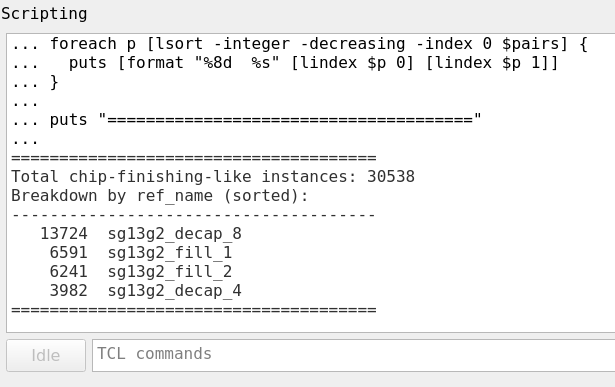

From this breakdown, we obtain the **30,538 filler cells**.

### Highlighting all filler/decap instances (Tcl)

To highlight all filler/decap instances (here matching `sg13g2_fill_*` and `sg13g2_decap_*`) in the GUI:

```tcl
# 0) Clear previous highlights
::gui::clear_highlights

# 1) Collect ALL "chip finishing" instances
set fill_objs {}
foreach c [get_cells -hier *] {
  set ref [get_property $c ref_name]
  if { [string match "sg13g2_fill_*"  $ref] ||
       [string match "sg13g2_decap_*" $ref] } {
    lappend fill_objs $c
  }
}
puts "Found [llength $fill_objs] fill/decap instances"

# 2) Highlight in chunks (to avoid freezing the GUI)
set chunk 200
set n [llength $fill_objs]
for {set i 0} {$i < $n} {incr i $chunk} {
  set sub [lrange $fill_objs $i [expr {$i+$chunk-1}]]
  foreach obj $sub {
    set inst_name [get_property $obj full_name]
    if {$inst_name eq ""} { set inst_name [get_property $obj name] }
    ::gui::highlight_inst $inst_name
  }
  update
}

puts "Done highlighting fill/decap."
```

This produces **all** filler/decap instances highlighted (~30k) as shown below:

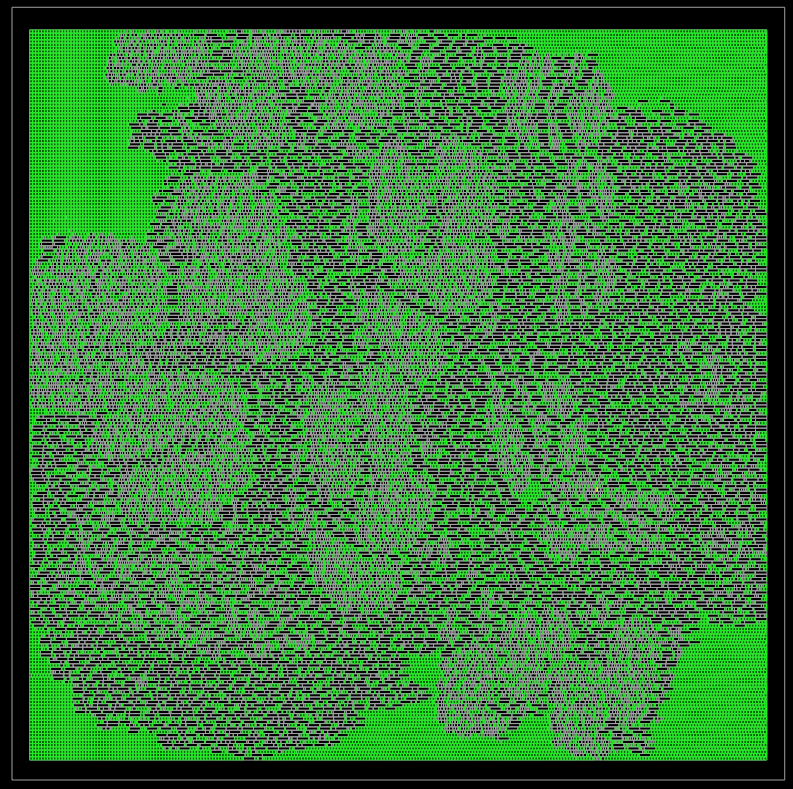

The observed pattern is a correct and expected outcome of the automated chip-finishing stage in LibreLane/OpenROAD

## 12) Clock (CTS Visualization)

To inspect the **clock tree after Clock Tree Synthesis (CTS)** in OpenROAD, load the post-CTS database directly:

```tcl
read_db 35-openroad-cts/top_chip.odb
```

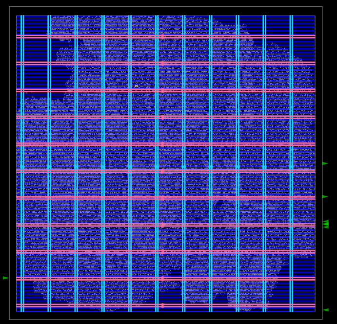

---

### Observed CTS Topology

The post-CTS view clearly shows a **horizontal clock trunk–based CTS configuration**.

Key observations:

- **Horizontal clock trunks** span the core area and serve as the primary global clock distribution paths.
- **Local clock branches and drops** feed clock buffers closer to the sequential elements.
- **Leaf clock buffers** (e.g. `clkbuf_leaf_*_i_clk`) deliver the clock directly to flip-flop clock pins.
- The clock routing is visually distinct from data routing, confirming the use of **dedicated clock routing resources**.

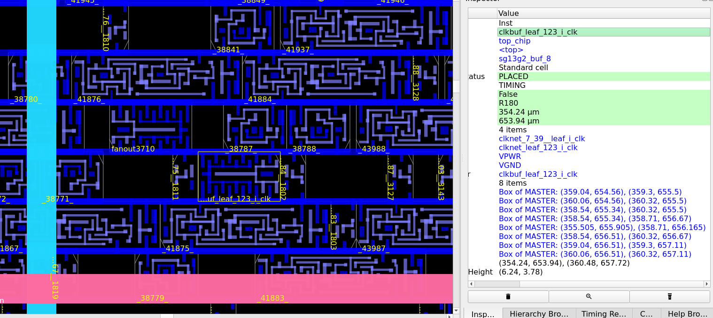


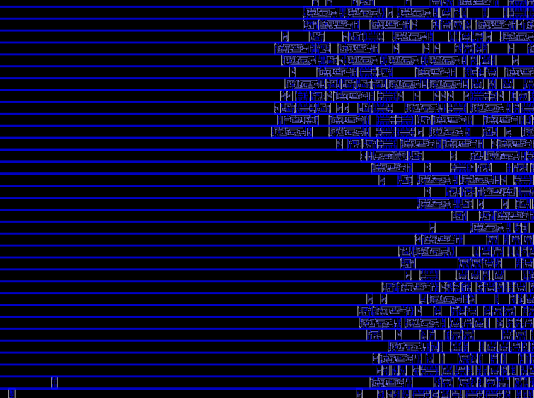


The resulting horizontal trunk-based topology is a **valid and expected outcome**, providing robust and uniform clock delivery across the design.


## 13) IO and Power/Ground

### Available IOs (10 pins)

**Power/Ground (INOUT, SPECIAL):**
- `VPWR`
- `VGND`

**Signals (INPUT):**
- `i_clk`
- `i_rst_n`
- `i_serial_rx`
- `i_spi_mosi`
- `i_spi_sclk`
- `i_spi_ss_n`

**Signals (OUTPUT):**
- `o_serial_tx`
- `o_spi_miso`

---

## Inspecting IOs and Power Nets in OpenROAD

The final design database is loaded in OpenROAD using:

```tcl
read_db final/odb/top_chip.odb
```

To list all top-level ports and their directions:

```tcl
# List all top-level ports (names + direction)
foreach p [get_ports *] {
  puts "[get_property $p name]\t[get_property $p direction]"
}
```

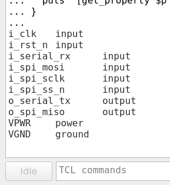

---

## Power / Ground Visualization (VPWR / VGND)

To highlight the power and ground networks:

```tcl
# Highlight VPWR (power)
foreach n [get_nets -hier VPWR] {
  catch { ::gui::highlight_net [get_property $n name] }
}

# Highlight VGND (ground)
foreach n [get_nets -hier VGND] {
  catch { ::gui::highlight_net [get_property $n name] }
}
```

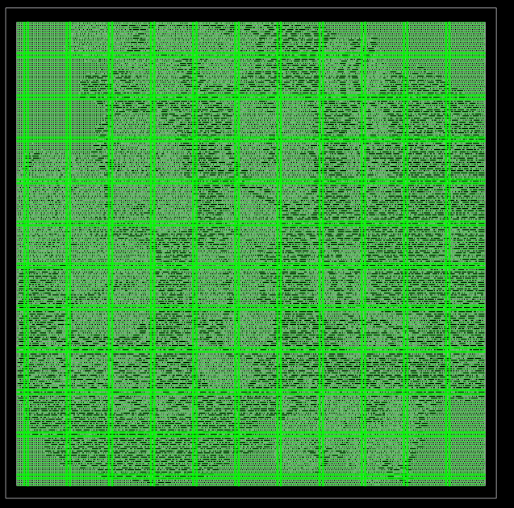

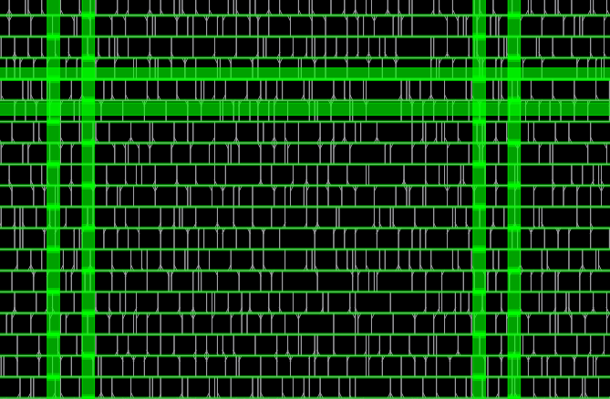

- **Thick green columns:** Power trunks / main straps  
- **Thin green columns:** Secondary power grid / local straps (implemented on slightly lower metal layers)

---

## IO Visualization

To visualize only the IO signal nets:

```tcl
::gui::clear_highlights

# INPUT nets (batch 1)
foreach n {i_clk i_rst_n i_serial_rx i_spi_mosi i_spi_sclk i_spi_ss_n} {
  catch { ::gui::highlight_net $n }
}

# OUTPUT nets (batch 2)
foreach n {o_serial_tx o_spi_miso} {
  catch { ::gui::highlight_net $n }
}

puts "Done: highlighted only IO nets (inputs vs outputs)."
```

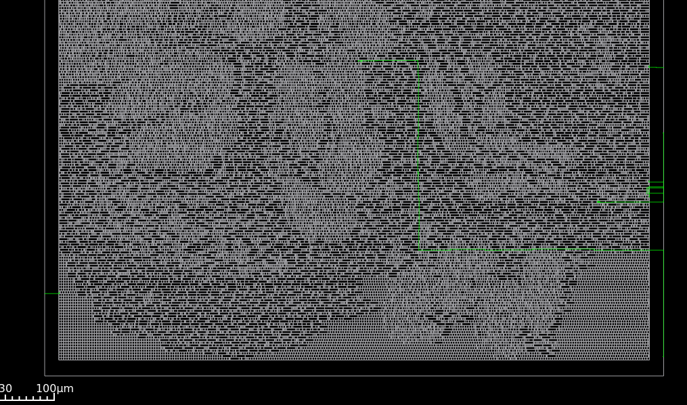

### Inputs only

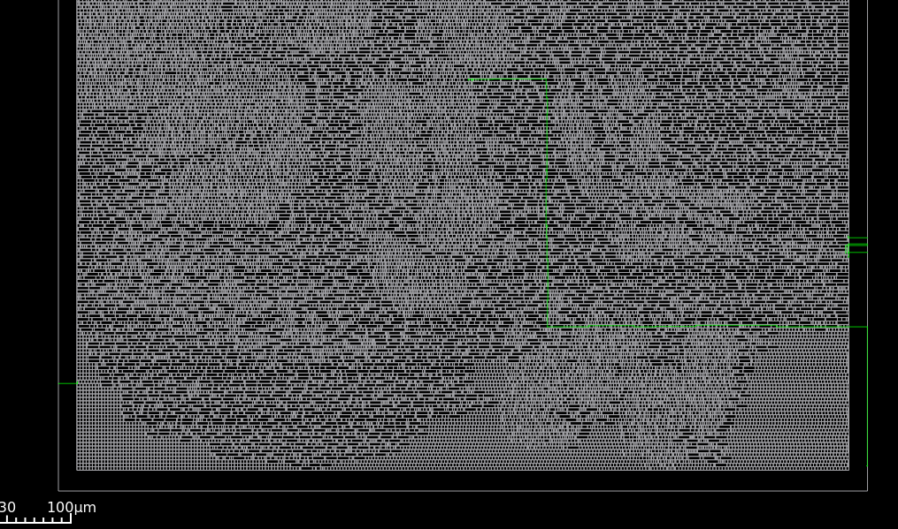

### Outputs only

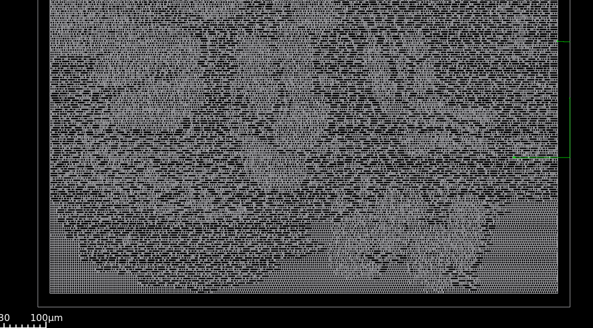

---

## IOs by Name

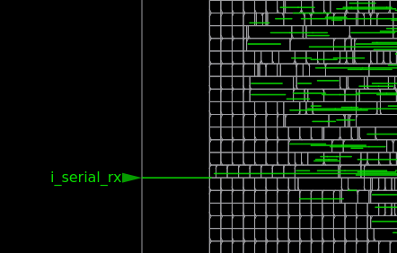

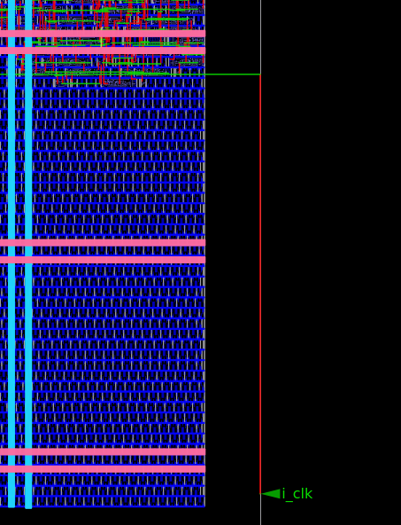

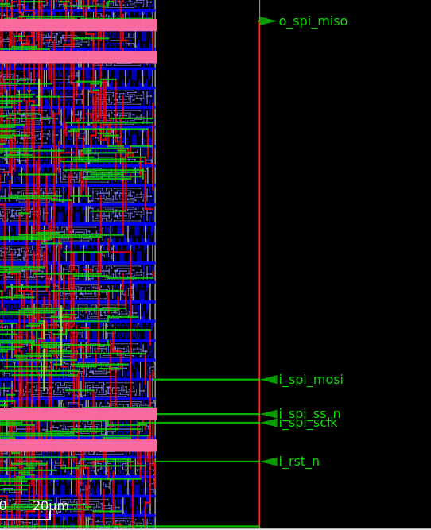

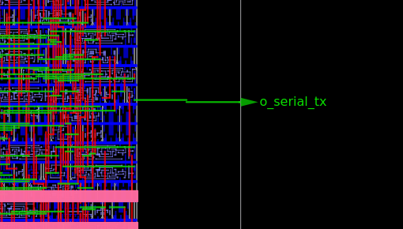