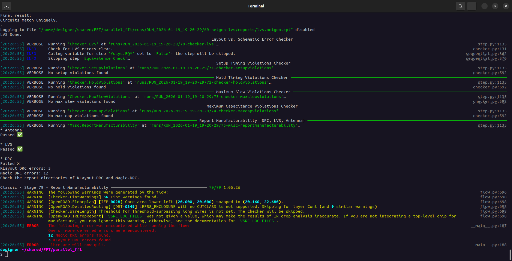
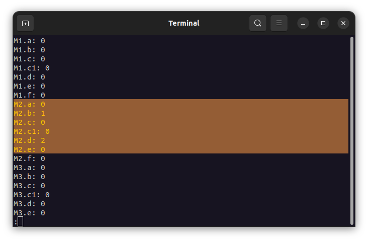
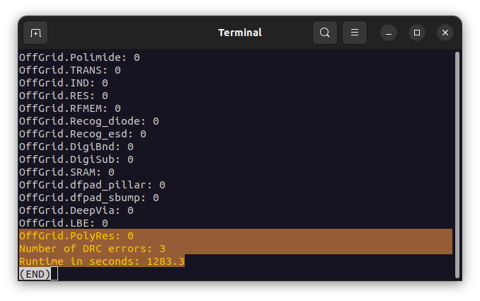
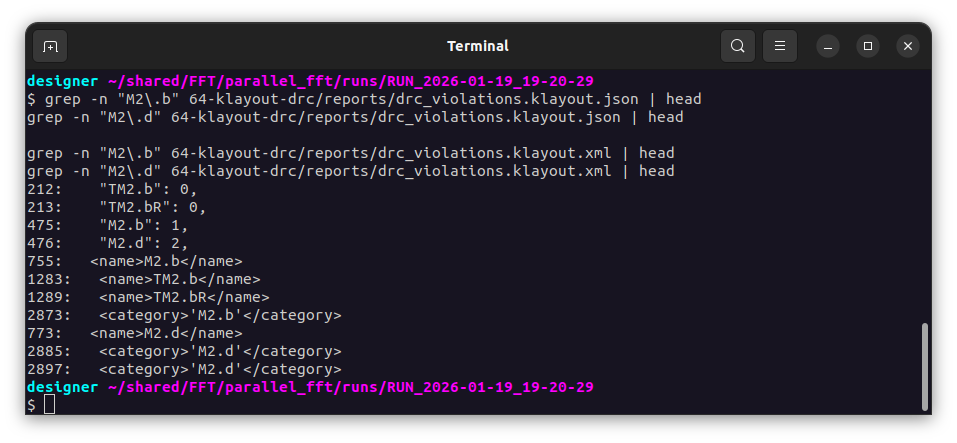
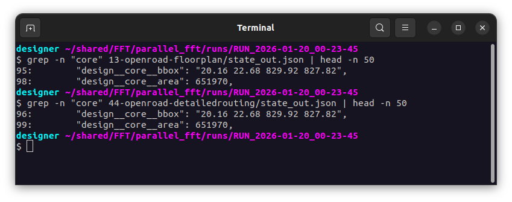
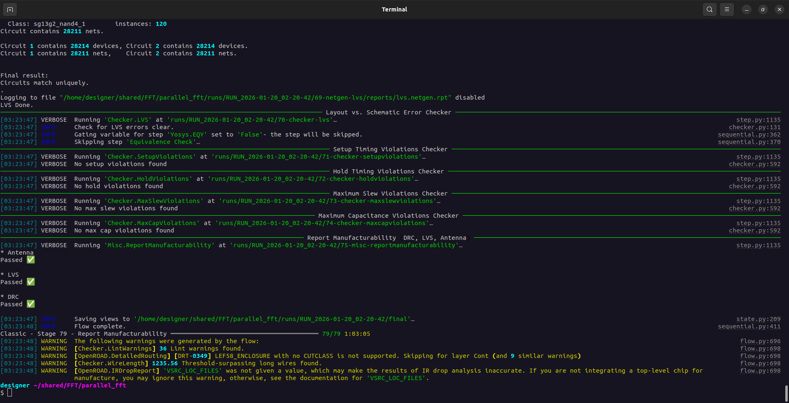
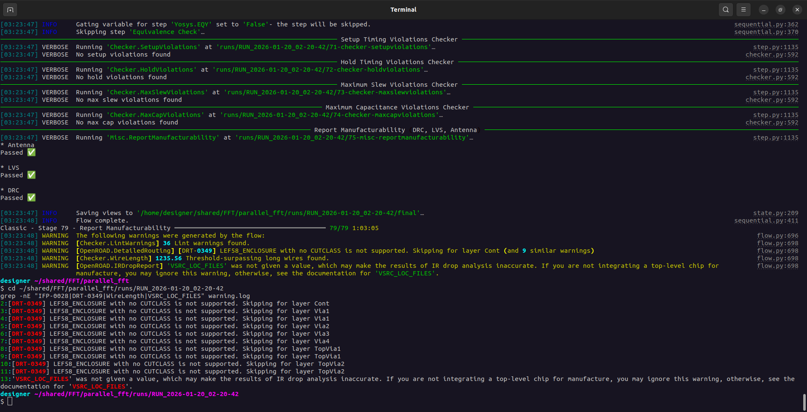
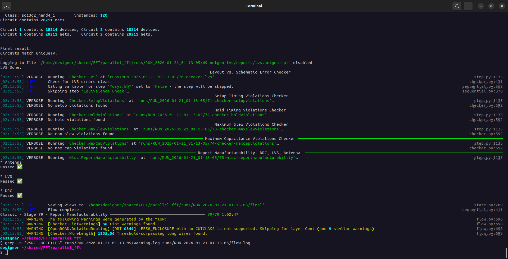
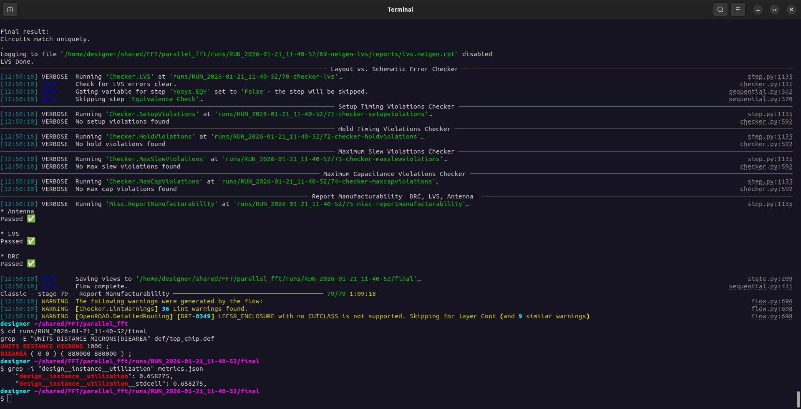

# Parallel FFT – PD Log (LibreLane)

## RTL files used (relative paths)

> **Repository root:** `parallel_fft/`  
> **Relative paths:** from `parallel_fft/` (i.e., `dir::` resolves from this root when using `--design-dir`)

| Block | File | Relative path |
|---|---|---|
| Top | `top_chip.v` | `design/rtl/top_chip.v` |
| FFT | `fft32.v` | `design/rtl/fft32.v` |
| FFT | `fft8.v` | `design/rtl/fft8.v` |
| FFT | `fft4.v` | `design/rtl/fft4.v` |
| Helpers | `buffer_parallel2serial.v` | `design/rtl/buffer_parallel2serial.v` |
| Helpers | `clip_round.v` | `design/rtl/clip_round.v` |
| Helpers | `round.v` | `design/rtl/round.v` |
| Helpers | `shift_r2.v` | `design/rtl/shift_r2.v` |
| Helpers | `shift_r4.v` | `design/rtl/shift_r4.v` |
| MDC8P | `fft_mdc_8p.v` | `design/rtl/fft_mdc_8p/fft_mdc_8p.v` |
| MDC8P | `mdc8p_ctrl_in.v` | `design/rtl/fft_mdc_8p/ctrl_in/mdc8p_ctrl_in.v` |
| MDC8P | `mdc8p_ctrl_out.v` | `design/rtl/fft_mdc_8p/ctrl_out/mdc8p_ctrl_out.v` |
| MDC8P | `mdc8p_stage1.v` | `design/rtl/fft_mdc_8p/stages/mdc8p_stage1.v` |
| MDC8P | `mdc8p_stage2.v` | `design/rtl/fft_mdc_8p/stages/mdc8p_stage2.v` |
| MDC8P | `mdc8p_stage3.v` | `design/rtl/fft_mdc_8p/stages/mdc8p_stage3.v` |
| Twiddles | `twiddle_interface.v` | `design/rtl/twiddle_interface/twiddle_interface.v` |
| Common | `btfly_2.v` | `design/rtl/common_modules/btfly_2.v` |
| Common | `btfly_4.v` | `design/rtl/common_modules/btfly_4.v` |
| Common | `btfly_8.v` | `design/rtl/common_modules/btfly_8.v` |
| Common | `complex_multiplier.v` | `design/rtl/common_modules/complex_multiplier.v` |
| Common | `ds_switch.v` | `design/rtl/common_modules/ds_switch.v` |
| Common | `rx_serializer.v` | `design/rtl/common_modules/rx_serializer.v` |
| Common | `tx_serializer.v` | `design/rtl/common_modules/tx_serializer.v` |
| Common | `xfft_cell.v` | `design/rtl/common_modules/xfft_cell.v` |
| Common | `signal_generator.v` | `design/rtl/common_modules/signal_generator.v` |
| Debug | `debug_system.v` | `design/rtl/debug_unit/debug_system.v` |
| Debug | `debug_unit.v` | `design/rtl/debug_unit/debug_unit.v` |
| Debug | `spi_slave_mode0.v` | `design/rtl/debug_unit/spi_slave_mode0.v` |
| Debug | `cdc_snapshot.v` | `design/rtl/debug_unit/cdc_snapshot.v` |

---

## File/module conflict: `cdc_snapshot.v`

There are two copies of the same module in the repository:

- `design/rtl/common_modules/cdc_snapshot/cdc_snapshot.v`
- `design/rtl/debug_unit/cdc_snapshot.v`

**Decision:** use **only** `design/rtl/debug_unit/cdc_snapshot.v` to avoid duplicate module definitions.

---

## Project
- Design: `top_chip`
- PDK: `ihp-sg13g2`
- Clock: `i_clk` @ 50 ns
- Repo root: `parallel_fft/`
- SDC: `librelane/constraints/top.sdc`

---

## Run: `RUN_2026-01-18_04-06-07`

- DIE_AREA: [0, 0, 1000, 1000]
- CORE_AREA: [20, 20, 980, 980]


### Configuration (`librelane/config.yaml`)

```yaml
DESIGN_NAME: top_chip

VERILOG_FILES:
  # Top / FFT
  - dir::design/rtl/top_chip.v
  - dir::design/rtl/fft32.v
  - dir::design/rtl/fft8.v
  - dir::design/rtl/fft4.v

  # Datapath helpers
  - dir::design/rtl/buffer_parallel2serial.v
  - dir::design/rtl/clip_round.v
  - dir::design/rtl/round.v
  - dir::design/rtl/shift_r2.v
  - dir::design/rtl/shift_r4.v

  # MDC8P
  - dir::design/rtl/fft_mdc_8p/fft_mdc_8p.v
  - dir::design/rtl/fft_mdc_8p/ctrl_in/mdc8p_ctrl_in.v
  - dir::design/rtl/fft_mdc_8p/ctrl_out/mdc8p_ctrl_out.v
  - dir::design/rtl/fft_mdc_8p/stages/mdc8p_stage1.v
  - dir::design/rtl/fft_mdc_8p/stages/mdc8p_stage2.v
  - dir::design/rtl/fft_mdc_8p/stages/mdc8p_stage3.v

  # Twiddles
  - dir::design/rtl/twiddle_interface/twiddle_interface.v

  # Common modules
  - dir::design/rtl/common_modules/btfly_2.v
  - dir::design/rtl/common_modules/btfly_4.v
  - dir::design/rtl/common_modules/btfly_8.v
  - dir::design/rtl/common_modules/complex_multiplier.v
  - dir::design/rtl/common_modules/ds_switch.v
  - dir::design/rtl/common_modules/rx_serializer.v
  - dir::design/rtl/common_modules/tx_serializer.v
  - dir::design/rtl/common_modules/xfft_cell.v
  - dir::design/rtl/common_modules/signal_generator.v

  # Debug / CDC / SPI
  - dir::design/rtl/debug_unit/debug_system.v
  - dir::design/rtl/debug_unit/debug_unit.v
  - dir::design/rtl/debug_unit/cdc_snapshot.v
  - dir::design/rtl/debug_unit/spi_slave_mode0.v

# Clock
CLOCK_PORT: i_clk
CLOCK_PERIOD: 50

# SDC
PNR_SDC_FILE: dir::librelane/constraints/top.sdc
SIGNOFF_SDC_FILE: dir::librelane/constraints/top.sdc

# Floorplan
FP_SIZING: absolute
DIE_AREA: [0, 0, 1000, 1000]
CORE_AREA: [20, 20, 980, 980]
```

### Result (signoff)
- LVS: PASS ✅
- DRC: PASS ✅
- Antenna: PASS ✅
- Setup violations: none ✅
- Hold violations: none ✅
- Max slew violations: none ✅
- Max capacitance violations: none ✅

### Artifacts
- Final views: `runs/RUN_2026-01-18_04-06-07/final/`
- LVS report: `runs/RUN_2026-01-18_04-06-07/69-netgen-lvs/reports/lvs.netgen.rpt`

### Flow warnings (summary)


---

*Lint warnings (Verilator):* `runs/RUN_2026-01-18_04-06-07/01-verilator-lint/verilator-lint.log`


***Warnings were observed. They do not directly affect the flow execution, so the run does not stop; however, some of them could indicate potential functional issues, so resolving them is proposed!***


## Metrics extracted from `44-openroad-detailedrouting/state_out.json` (OpenROAD detailed routing)


### Design size
- Instances (stdcells): **28,488**
- Routed nets: **28,063**
- IOs: **10** (`design__io`)
- Stdcell area: **464,100 µm²** (≈ **0.4641 mm²**)

### Floorplan / Area
- Die bbox: `0 0 1000 1000` → **1,000,000 µm²** (**1.0 mm²**) (TOTAL!)
- Core bbox (snapped): `20.16 22.68 979.68 979.02` -> Core area: **917,627 µm²** (≈ **0.9176 mm²**)
- Utilization (stdcells/core): **0.5058** (≈ **50.6%**) ; Interpretation: ~49.4% of the core is whitespace (comfortable margin for routing).

### Timing (slack)
**No timing violations reported (TNS/WNS = 0 in the reported corners).**  
Reported “worst” slacks:
- Corner `nom_fast_1p32V_m40C`:
  - Setup WS: **36.28 ns**
  - Hold WS: **0.123 ns**
- Corner `nom_slow_1p08V_125C`:
  - Setup WS: **19.13 ns**
  - Hold WS: **0.288 ns**
- Corner `nom_typ_1p20V_25C`:
  - Setup WS: **45.14 ns**
  - Hold WS: **0.176 ns**

> the target clock period is 50 ns, so the design **is very relaxed in setup**!!

### Power (estimated)
- Internal: **0.00583**
- Switching: **0.00173**
- Leakage: **6.02e-06**
- Total: **0.00756**  


### Routing and manufacturability
- Final router DRC: **0**
- Wirelength (detailed route): **705,400**
- Vias (total): **161,002** (singlecut: 161,002; multicut: 0)
- Antenna:
  - `route__antenna_violation__count`: **11**
  - `antenna__violating__nets`: **0**
  - `antenna_diodes_count`: **13**

> That means there was indeed an antenna risk during routing, and the flow **resolved it** by inserting 13 antenna diodes.


## Candidate sizes (estimated utilization)
Util estimate: `util ≈ stdcell_area / core_area` using 464,100 µm².

### Option  ~62.8%
- `DIE_AREA:  [0, 0, 900, 900]`
- `CORE_AREA: [20, 20, 880, 880]` → 860 × 860 = 739,600 µm²

### Option  ~69.0%
- `DIE_AREA:  [0, 0, 860, 860]`
- `CORE_AREA: [20, 20, 840, 840]` → 820 × 820 = 672,400 µm²

### Option  ~70.7% aggressive!!!
- `DIE_AREA:  [0, 0, 850, 850]`
- `CORE_AREA: [20, 20, 830, 830]` → 810 × 810 = 656,100 µm²


----


# Run Report (RUN_2026-01-19_15-27-49), aggressive!!!


- DIE_AREA: [0, 0, 850, 850]    (µm)
- CORE_AREA: [20, 20, 830, 830] (µm)


Derived from metrics:
- **Die bbox:** `0.0 0.0 850.0 850.0`
- **Core bbox:** `20.16 22.68 829.92 827.82`
- **Die area:** `722,500 µm²`
- **Core area:** `651,970 µm²`
- **Core utilization (stdcell):** `~0.704`

---

##  Run Status Summary

### Flow health
- **Flow errors:** `0`
- **Flow warnings:** `10`
- **Lint errors:** `0`
- **Lint warnings:** `36`
- **Unmapped instances:** `0`
- **Inferred latches:** `0`

### Design scale
- **Instances (total):** `28,210`
- **Stdcell area:** `458,878` (units per PDK)
- **Sequential cells:** `3,497`
- **Combinational cells:** `21,668`
- **Clock buffers:** `727`
- **Clock inverters:** `172`


Timing is reported for three corners. **No setup/hold violations were recorded**.

### Corner: nom_fast_1p32V_m40C
- **Setup violations:** `0` (WNS/TNS = 0)
- **Hold violations:** `0` (WNS/TNS = 0)
- **Reported setup worst slack (r2r):** `~36.28 ns`
- **Reported hold worst slack (r2r):** `~0.123 ns`

### Corner: nom_slow_1p08V_125C
- **Setup violations:** `0` (WNS/TNS = 0)
- **Hold violations:** `0` (WNS/TNS = 0)
- **Reported setup worst slack (r2r):** `~19.13 ns`
- **Reported hold worst slack (r2r):** `~0.288 ns`

### Corner: nom_typ_1p20V_25C
- **Setup violations:** `0` (WNS/TNS = 0)
- **Hold violations:** `0` (WNS/TNS = 0)
- **Reported setup worst slack (r2r):** `~45.17 ns`
- **Reported hold worst slack (r2r):** `~0.183 ns`

---


### Detailed routing DRC
- During iterative routing:
  - `iter:0` DRC errors: `7`
  - `iter:1` DRC errors: `1`
  - `iter:2` DRC errors: `1`
  - `iter:3` DRC errors: `0`
  - `iter:4` DRC errors: `0`
- **Final!!** `route__drc_errors = 0`

### Wire length + vias
- **Final routed wirelength:** `651,665`
- **Routed vias:** `163,804` (single-cut)

### Antenna
- **Antenna events during routing:** `route__antenna_violation__count = 6`
- **Final violating nets/pins:** `0 / 0`
- **Inserted antenna diodes:** `7`

> antenna issues were detected during routing and mitigated (diode insertion).

---


Even though DRC and timing are clean, the run reports **DRV (electrical design rule)** violations in the **fast** and **slow** corners.

## Corner: `nom_fast_1p32V_m40C`
- **Max slew violations:** `1954`
- **Max fanout violations:** `296`
- **Max capacitance violations:** `13`

## Corner: `nom_slow_1p08V_125C`
- **Max slew violations:** `2373` → many signals have overly slow edges (excessive transition time)
- **Max fanout violations:** `296` → many nets are driving too many loads
- **Max capacitance violations:** `13` → some nets have excessive capacitive load

## Corner: `nom_typ_1p20V_25C`
- **Max slew violations:** `0`
- **Max fanout violations:** `4`
- **Max capacitance violations:** `0`

## Why??
DRV violations indicate nets exceeding library electrical limits (transition/slew, fanout, or load capacitance). While they may not cause setup/hold failures at a **50 ns** clock period, they can reduce robustness across PVT corners, worsen signal integrity, and make signoff harder to justify.

In other words, the chip **meets timing and routing DRC**, but it **does not meet some library electrical constraints** when evaluated in the most demanding corners (**fast** and **slow**).

## Likely root causes
- **Global control nets** (reset/enable/control) with very large fanout and insufficient buffering.
- **Long interconnect nets** due to floorplan/utilization, increasing RC and therefore slew.


----
# RUN_2026-01-19_19-20-29 — DRC and warnings analysis

- `DIE_AREA:  [0, 0, 860, 860]`
- `CORE_AREA: [20, 20, 840, 840]`

The following is observed:



The next step is not to tweak knobs blindly, but to **identify exactly which rule fails and where**. For that, we first need to review the **markers** reported by the DRC tools (KLayout/Magic).


Inspect the KLayout DRC log:

```bash
cd ~/shared/FFT/parallel_fft/runs/RUN_2026-01-19_19-20-29
less 64-klayout-drc/klayout-drc.log
```

And we obtain:

  


- **Total number of DRC errors:** 3  
- All violations correspond to **Metal2 (M2)**, distributed as:
  - **1 violation of rule `M2.b`**
  - **2 violations of rule `M2.d`**



To understand the exact meaning of these rules, we consult the KLayout XML report:

```bash
sed -n '740,820p' 64-klayout-drc/reports/drc_violations.klayout.xml
```

From this, we conclude that the real issue in the **860×860** run is:

- **`M2.b (1)`** → *Min. Metal2 space or notch* = **0.21 µm**
- **`M2.d (2)`** → *Min. Metal2 area* = **0.144 µm²**

In other words: there is **one spacing/notch violation in M2** and **two minimum-area violations in M2**, typically associated with **very small Metal2 segments (“stubs” or “islands”)** generated during routing.

The next step is to extract the **coordinates and geometry** of these 3 violations to determine whether they occur in the PDN, near the core boundary, or in a specific routing region.

---

In addition to the DRC, some warnings are reported. In general they are not blocking, but they should be documented:

1) **`[IFP-0028] Core area ... snapped ...`**  
OpenROAD adjusts the `CORE_AREA` to the legal grid (placement sites/tracks).  
The point `(20.000, 20.000)` does not land on a valid location and is “snapped” to `(20.160, 22.680)`. This is not an error; it may slightly change the final layout.

solution: force the initial coordinates to match the snapped (legal) values:



by setting:
```bash
CORE_AREA: [20.16, 22.68, 829.92, 827.82]
```

2) **`LEF58_ENCLOSURE ... CUTCLASS`**  
Router warning about advanced LEF58 rules related to via *enclosure*. It indicates that some rules cannot be applied internally during routing, while final checking is performed by KLayout/Magic.

solution: this is a limitation of the TritonRoute/OpenROAD internal parser/DRC engine when encountering certain LEF58_ENCLOSURE rules if the tech LEF does not include (or does not provide in the expected format) CUTCLASS information. That is why the router prints “Skipping …”. This warning is fairly common in OpenROAD/LibreLane flows.

3) Long wires checker skipped  
The “long wires” checker is skipped because no threshold was defined. This is harmless; only that report is missing.

solution:
```bash
ERROR_ON_LONG_WIRE: false
WIRE_LENGTH_THRESHOLD: 400   # µm (reasonable starting value)
```

4) **`VSRC_LOC_FILES` not defined (IR drop)**  
The IR drop report may be inaccurate because voltage source locations (pads/bumps/VSRC) were not specified. This is only critical if a realistic power analysis is required.

solution: VSRC_LOC_FILES is used to tell OpenROAD/LibreLane where the VDD and GND “sources” are located.

run with the proposed solutions applied:

```bash
CORE_AREA: [20.16, 22.68, 829.92, 827.82]
ERROR_ON_LONG_WIRE: false
WIRE_LENGTH_THRESHOLD: 400   
```






### Observations from the previous warnings

- **IFP-0028 (core area snapped)** → **NOT present** in the `grep` output ✅  
  **Conclusion:** this warning is no longer present in this run.


---

- **LEF58_ENCLOSURE / CUTCLASS (DRT-0349)** → **Still present** ⚠️  
  It appears repeatedly for multiple via-related layers (Cont, Via1… TopVia2).

- **Long wires checker skipped** → **Changed** ⚠️  
  It is no longer “skipped”. The checker ran and reports:  
  `1235.56 Threshold-surpassing long wires found.`  
  (Meaning: some nets exceed the configured wirelength threshold; this is not a DRC/LVS failure.)

- **VSRC_LOC_FILES not defined (IR drop)** → **Still present** ⚠️  
  The IR drop warning remains because voltage source locations (VDD/GND sources) were not provided.


----

## Avoid `VSRC_LOC_FILES not defined (IR drop)`

To address this warning, create the IR-drop voltage source location files:

```bash
augusto@augustoCabrera ~/parallel_fft $ mkdir -p librelane/irdrop

cat > librelane/irdrop/vpwr.csv <<'EOF'
25,25,20,1.2
825,25,20,1.2
25,825,20,1.2
825,825,20,1.2
EOF

cat > librelane/irdrop/vgnd.csv <<'EOF'
25,25,20,0.0
825,25,20,0.0
25,825,20,0.0
825,825,20,0.0
EOF
augusto@augustoCabrera ~/parallel_fft $
```

Then add the following to the YAML configuration:

```yaml
VSRC_LOC_FILES:
  VPWR: dir::librelane/irdrop/vpwr.csv
  VGND: dir::librelane/irdrop/vgnd.csv
```



This confirms the VPWR/VGND source locations are being picked up correctly, since the warning has disappeared completely.


----


# WireLength: “Threshold-surpassing long wires found”

With an 850×850 µm die, a ~1235 µm net is entirely plausible (it can span the chip diagonally plus routing detours). This is not unusual.

**Solution:** set `WIRE_LENGTH_THRESHOLD: 1300`


----


# Run RUN_2026-01-21_11-40-52


The final DEF file confirms unambiguously that **all floorplan dimensions are in micrometers (µm)**.

From `def/top_chip.def`:

```
UNITS DISTANCE MICRONS 1000 ;
DIEAREA ( 0 0 ) ( 880000 880000 ) ;
```

Interpretation:
- `1000 DBU = 1 µm`
- `880000 DBU / 1000 = 880 µm`

**Final die size:**  
**880 µm × 880 µm = 0.7744 mm²**


```yaml
FP_SIZING: absolute

DIE_AREA:  [0, 0, 880, 880]
CORE_AREA: [20.16, 22.68, 859.84, 857.32]
```

### Core dimensions
- Core width  = 839.68 µm
- Core height = 834.64 µm

### Core area
- ≈ 700,800 µm²
- ≈ 0.7008 mm²

---



- **Core utilization:** 65.83%


----

# run `RUN_2026-01-22_16-15-21` (75%)

DIE_AREA:  [0, 0, 827, 827]
CORE_AREA: [20.16, 22.68, 806.84, 804.32]


The final utilization reported is:


---

